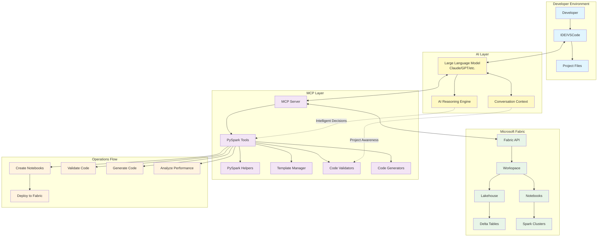

# Microsoft Fabric MCP Server

A comprehensive Python-based MCP (Model Context Protocol) server for interacting with Microsoft Fabric APIs using natural language through Claude Desktop.

**Use natural language to manage your Microsoft Fabric workspaces, lakehouses, warehouses, notebooks, and more!**

## How to Run

Run the primary entry-point script to start the MCP server locally:

```bash
python main.py
```

## How to Test

Execute the project tests with `pytest` targeting the main test module:

```bash
pytest test_main.py
```

## 🚀 Quick Start

Want to ask Claude Desktop questions like:
- "List all my Fabric workspaces"
- "Create a new lakehouse called 'sales-data' in my analytics workspace"
- "Show me all tables in my lakehouse"
- "Generate a PySpark notebook for ETL processing"

### 5-Minute Setup:

1. **Install dependencies:** `uv sync`
2. **Authenticate with Azure:** `az login`
3. **Configure Claude Desktop:** Add this project to `claude_desktop_config.json`
4. **Restart Claude Desktop**
5. **Start querying!** Ask Claude: "List all my Fabric workspaces"

Detailed instructions below ⬇️

## 🌟 Features

### **Core Fabric Operations**
- ✅ Workspace, lakehouse, warehouse, and table management
- ✅ Delta table preview, history, schema, and maintenance (OPTIMIZE/VACUUM)
- ✅ SQL endpoint orchestration for query, export, and notebook jobs
- ✅ Pipelines, dataflows, and refresh schedule automation
- ✅ Power BI reporting and semantic model refresh workflows
- ✅ Microsoft Graph messaging, directory, and drive insights

### **Power BI Semantic Model Tools** 🆕
- 🔍 **Model schema exploration** - Retrieve complete model structures with tables, columns, and relationships
- 📊 **DAX measure management** - Create, update, delete, and list DAX measures programmatically
- 🎯 **Measure discovery** - Search and retrieve specific measure definitions
- ⚡ **Performance analysis** - Execute and analyze DAX queries with timing metrics
- 🤖 **Agentic Power BI** - Enable Claude to interact with Power BI models end-to-end

### **Advanced PySpark Development**
- 📓 **Intelligent notebook creation** with 6 specialized templates
- 🔧 **Smart code generation** for common PySpark operations
- ✅ **Comprehensive validation** with syntax and best practices checking
- 🎯 **Fabric-specific optimizations** and compatibility checks
- 📊 **Performance analysis** with scoring and optimization recommendations
- 🚀 **Real-time monitoring** and execution insights

### **Natural Language Interface via Claude Desktop**
- 🤖 **Ask questions in plain English** about your Fabric resources
- 🧠 **Context-aware assistance** with conversation memory
- 🎨 **Intelligent code formatting** and explanations
- 📈 **Smart optimization suggestions** based on project patterns

## 🏗️ Architecture



### **Interaction Flow**
1. **Developer requests assistance in IDE**
2. **IDE communicates with LLM (Claude/GPT)**
3. **LLM analyzes using context and reasoning**
4. **LLM calls MCP server tools intelligently**
5. **MCP tools interact with Fabric API**
6. **Results flow back through LLM with intelligent formatting**
7. **Developer receives contextual, smart responses**

## 📋 Prerequisites

Before you begin, ensure you have:
- **Python 3.12+** installed
- **Claude Desktop** installed ([Download here](https://claude.ai/download))
- **Azure CLI** installed ([Download here](https://learn.microsoft.com/en-us/cli/azure/install-azure-cli))
- **uv** package manager ([Install here](https://docs.astral.sh/uv/getting-started/installation/))
- **Access to a Microsoft Fabric workspace** with appropriate permissions

## 🔧 Setup Instructions

### Step 1: Install Dependencies

1. **Navigate to this project directory:**
   ```bash
   cd path/to/ms-fabric-core-tools-mcp
   ```

2. **Set up the Python virtual environment:**
   ```bash
   uv sync
   ```
   This will create a `.venv` folder and install all required Python packages.

### Step 2: Authenticate with Azure

Authenticate with Azure CLI and request a token for Microsoft Fabric:

```bash
# Login to Azure
az login

# Get an access token for Fabric (optional - to verify authentication)
az account get-access-token --resource https://api.fabric.microsoft.com/
```

**Important:** Make sure the account you use has at least **Contributor** or **Member** role in your Fabric workspace to create resources.

### Step 3: Configure Claude Desktop

1. **Locate your Claude Desktop configuration file:**
   - **Windows:** `%APPDATA%\Claude\claude_desktop_config.json`
   - **macOS:** `~/Library/Application Support/Claude/claude_desktop_config.json`
   - **Linux:** `~/.config/Claude/claude_desktop_config.json`

2. **Edit the configuration file** and add the MCP server configuration:

   **For Windows:**
   ```json
   {
     "mcpServers": {
      "ms-fabric-core-tools-mcp": {
        "command": "C:\\path\\to\\ms-fabric-core-tools-mcp\\.venv\\Scripts\\python.exe",
         "args": [
          "C:\\path\\to\\ms-fabric-core-tools-mcp\\fabric_mcp_stdio.py"
         ],
         "env": {
           "USERPROFILE": "C:\\Users\\YourUsername"
         }
       }
     }
   }
   ```

   **For macOS/Linux:**
   ```json
   {
     "mcpServers": {
      "ms-fabric-core-tools-mcp": {
        "command": "/path/to/ms-fabric-core-tools-mcp/.venv/bin/python",
         "args": [
          "/path/to/ms-fabric-core-tools-mcp/fabric_mcp_stdio.py"
         ],
         "env": {
           "HOME": "/home/yourusername"
         }
       }
     }
   }
   ```

   **Important:** Replace the paths with the actual full paths on your system!

3. **Save the configuration file**

### Step 4: Restart Claude Desktop

Close Claude Desktop completely and restart it. The MCP server will now be available.

### Step 5: Test the Connection

Open Claude Desktop and try these commands:

1. **List your workspaces:**
   ```
   List all my Microsoft Fabric workspaces
   ```

2. **Set a workspace:**
   ```
   Set my workspace to "workspace-name"
   ```

3. **List lakehouses:**
   ```
   Show me all lakehouses in my workspace
   ```

4. **Create a lakehouse:**
   ```
   Create a new lakehouse called "test-lakehouse" in my workspace
   ```

That's it! You can now use natural language to interact with Microsoft Fabric!

## 🎯 Common Use Cases

### Example Queries You Can Ask Claude Desktop:

**Workspace Management:**
- "List all my Fabric workspaces"
- "Set my workspace to 'analytics-prod'"

**Lakehouse Operations:**
- "Show me all lakehouses in my workspace"
- "Create a lakehouse called 'sales-data' with description 'Sales analytics data'"
- "List all tables in the 'sales-data' lakehouse"
- "Show me the schema for the 'transactions' table"

**Warehouse Operations:**
- "List all warehouses in my workspace"
- "Create a warehouse called 'reporting-dw'"

**PySpark Notebook Creation:**
- "Create a PySpark notebook for ETL processing"
- "Generate a PySpark notebook with ML template"
- "Create a Fabric-optimized notebook for data analytics"

**Code Generation:**
- "Generate PySpark code to read from a lakehouse table"
- "Show me code to merge Delta tables"
- "Create code for data quality checks"

**Performance Analysis:**
- "Analyze the performance of my notebook"
- "Validate this PySpark code for best practices"

## 🛠️ Complete Tool Reference

### **1. Workspace Management**

#### `list_workspaces`
List all available Fabric workspaces.
```python
# Usage in LLM: "List all my Fabric workspaces"
```

#### `set_workspace`
Set the current workspace context for the session.
```python
set_workspace(workspace="Analytics-Workspace")
```

### **2. Lakehouse Operations**

#### `list_lakehouses`
List all lakehouses in a workspace.
```python
list_lakehouses(workspace="Analytics-Workspace")
```

#### `create_lakehouse`
Create a new lakehouse.
```python
create_lakehouse(
    name="Sales-Data-Lake",
    workspace="Analytics-Workspace",
    description="Sales data lakehouse"
)
```

#### `set_lakehouse`
Set current lakehouse context.
```python
set_lakehouse(lakehouse="Sales-Data-Lake")
```

### **3. Warehouse Operations**

#### `list_warehouses`
List all warehouses in a workspace.
```python
list_warehouses(workspace="Analytics-Workspace")
```

#### `create_warehouse`
Create a new warehouse.
```python
create_warehouse(
    name="Sales-DW",
    workspace="Analytics-Workspace", 
    description="Sales data warehouse"
)
```

#### `set_warehouse`
Set current warehouse context.
```python
set_warehouse(warehouse="Sales-DW")
```

### **4. Table Operations**

#### `list_tables`
List all tables in a lakehouse.
```python
list_tables(workspace="Analytics-Workspace", lakehouse="Sales-Data-Lake")
```

#### `get_lakehouse_table_schema`
Get schema for a specific table.
```python
get_lakehouse_table_schema(
    workspace="Analytics-Workspace",
    lakehouse="Sales-Data-Lake",
    table_name="transactions"
)
```

#### `get_all_lakehouse_schemas`
Get schemas for all tables in a lakehouse.
```python
get_all_lakehouse_schemas(
    workspace="Analytics-Workspace",
    lakehouse="Sales-Data-Lake"
)
```

#### `set_table`
Set current table context.
```python
set_table(table_name="transactions")
```

#### `table_preview`
Preview rows from a Delta table through the SQL endpoint.
```python
table_preview(
    workspace="Analytics-Workspace",
    lakehouse="Sales-Data-Lake",
    table="transactions",
    limit=25
)
```

#### `table_schema`
Retrieve detailed schema and metadata for a table.
```python
table_schema(
    workspace="Analytics-Workspace",
    lakehouse="Sales-Data-Lake",
    table="transactions"
)
```

#### `describe_history`
Inspect the Delta transaction log history.
```python
describe_history(
    workspace="Analytics-Workspace",
    lakehouse="Sales-Data-Lake",
    table="transactions",
    limit=10
)
```

#### `optimize_delta`
Compact files and optionally Z-Order a Delta table.
```python
optimize_delta(
    workspace="Analytics-Workspace",
    lakehouse="Sales-Data-Lake",
    table="transactions",
    zorder_by=["customer_id", "order_date"]
)
```

#### `vacuum_delta`
Remove old files from Delta storage.
```python
vacuum_delta(
    workspace="Analytics-Workspace",
    lakehouse="Sales-Data-Lake",
    table="transactions",
    retain_hours=72
)
```

### **5. SQL Operations**

#### `get_sql_endpoint`
Resolve connection details for a lakehouse or warehouse SQL endpoint.
```python
get_sql_endpoint(
    workspace="Analytics-Workspace",
    lakehouse="Sales-Data-Lake",
    type="lakehouse"
)
```

#### `sql_query`
Execute SQL against Fabric endpoints and receive structured rows.
```python
sql_query(
    workspace="Analytics-Workspace",
    lakehouse="Sales-Data-Lake",
    query="SELECT TOP 25 * FROM dbo.transactions",
    type="lakehouse"
)
```

#### `sql_explain`
Retrieve estimated execution plans for SQL statements.
```python
sql_explain(
    workspace="Analytics-Workspace",
    lakehouse="Sales-Data-Lake",
    query="SELECT customer_id, SUM(amount) FROM dbo.transactions GROUP BY customer_id"
)
```

#### `sql_export`
Export query results to OneLake as CSV or Parquet.
```python
sql_export(
    workspace="Analytics-Workspace",
    lakehouse="Sales-Data-Lake",
    query="SELECT * FROM dbo.transactions WHERE order_date >= '2024-01-01'",
    target_path="Files/exports/transactions_2024.csv",
    file_format="csv"
)
```

### **6. Data Loading**

#### `load_data_from_url`
Load data from URL into tables.
```python
load_data_from_url(
    url="https://example.com/data.csv",
    destination_table="new_data",
    workspace="Analytics-Workspace",
    lakehouse="Sales-Data-Lake"
)
```

### **7. Reports & Models**

#### `list_reports`
List all reports in a workspace.
```python
list_reports(workspace="Analytics-Workspace")
```

#### `get_report`
Get specific report details.
```python
get_report(workspace="Analytics-Workspace", report_id="report-id")
```

#### `list_semantic_models`
List semantic models in workspace.
```python
list_semantic_models(workspace="Analytics-Workspace")
```

#### `get_semantic_model`
Get specific semantic model.
```python
get_semantic_model(workspace="Analytics-Workspace", model_id="model-id")
```

### **8. Basic Notebook Operations**

#### `list_notebooks`
List all notebooks in a workspace.
```python
list_notebooks(workspace="Analytics-Workspace")
```

#### `get_notebook_content`
Retrieve notebook content.
```python
get_notebook_content(
    workspace="Analytics-Workspace",
    notebook_id="notebook-id"
)
```

#### `update_notebook_cell`
Update specific notebook cells.
```python
update_notebook_cell(
    workspace="Analytics-Workspace",
    notebook_id="notebook-id",
    cell_index=0,
    cell_content="print('Hello, Fabric!')",
    cell_type="code"
)
```

### **9. Advanced PySpark Notebook Creation**

#### `create_pyspark_notebook`
Create notebooks from basic templates.
```python
create_pyspark_notebook(
    workspace="Analytics-Workspace",
    notebook_name="Data-Analysis",
    template_type="analytics"  # Options: basic, etl, analytics, ml
)
```

#### `create_fabric_notebook`
Create Fabric-optimized notebooks.
```python
create_fabric_notebook(
    workspace="Analytics-Workspace",
    notebook_name="Fabric-Pipeline",
    template_type="fabric_integration"  # Options: fabric_integration, streaming
)
```

### **10. PySpark Code Generation**

#### `generate_pyspark_code`
Generate code for common operations.
```python
generate_pyspark_code(
    operation="read_table",
    source_table="sales.transactions",
    columns="id,amount,date"
)

# Available operations:
# - read_table, write_table, transform, join, aggregate
# - schema_inference, data_quality, performance_optimization
```

#### `generate_fabric_code`
Generate Fabric-specific code.
```python
generate_fabric_code(
    operation="read_lakehouse",
    lakehouse_name="Sales-Data-Lake",
    table_name="transactions"
)

# Available operations:
# - read_lakehouse, write_lakehouse, merge_delta, performance_monitor
```

### **11. Code Validation & Analysis**

#### `validate_pyspark_code`
Validate PySpark code syntax and best practices.
```python
validate_pyspark_code(code="""
df = spark.table('transactions')
df.show()
""")
```

#### `validate_fabric_code`
Validate Fabric compatibility.
```python
validate_fabric_code(code="""
df = spark.table('lakehouse.transactions')
df.write.format('delta').saveAsTable('summary')
""")
```

#### `analyze_notebook_performance`
Comprehensive performance analysis.
```python
analyze_notebook_performance(
    workspace="Analytics-Workspace",
    notebook_id="notebook-id"
)
```

### **12. Pipelines & Dataflows**

#### `pipeline_run`
Trigger a Fabric pipeline execution.
```python
pipeline_run(
    workspace="Analytics-Workspace",
    pipeline="Daily-Ingest",
    parameters={"RunDate": "2024-01-01"}
)
```

#### `pipeline_status`
Check the status of a pipeline run.
```python
pipeline_status(
    workspace="Analytics-Workspace",
    pipeline="Daily-Ingest",
    run_id="00000000-0000-0000-0000-000000000000"
)
```

#### `pipeline_logs`
Retrieve diagnostic logs for a pipeline run.
```python
pipeline_logs(
    workspace="Analytics-Workspace",
    pipeline="Daily-Ingest",
    run_id="00000000-0000-0000-0000-000000000000"
)
```

#### `dataflow_refresh`
Request a refresh for a Fabric Dataflow Gen2.
```python
dataflow_refresh(
    workspace="Analytics-Workspace",
    dataflow="Customer-Dim"
)
```

### **13. Schedules**

#### `schedule_list`
List refresh schedules for a workspace or specific item.
```python
schedule_list(workspace="Analytics-Workspace")

# or for a specific semantic model / report
schedule_list(
    workspace="Analytics-Workspace",
    item="Sales-Model"
)
```

#### `schedule_set`
Create or update a refresh schedule for an item.
```python
schedule_set(
    workspace="Analytics-Workspace",
    item="Sales-Model",
    schedule={
        "frequency": "Daily",
        "timeZone": "UTC",
        "times": ["06:00"]
    }
)
```

### **14. Power BI Artifacts**

#### `semantic_model_refresh`
Trigger a refresh for a semantic model.
```python
semantic_model_refresh(
    workspace="Analytics-Workspace",
    model="Sales-Model",
    refresh_type="Full"
)
```

#### `dax_query`
Execute DAX against a semantic model via XMLA.
```python
dax_query(
    workspace="Analytics-Workspace",
    dataset="Sales-Model",
    query="EVALUATE TOPN(10, 'DimCustomer')"
)
```

#### `report_export`
Export a report to PDF or PowerPoint.
```python
report_export(
    workspace="Analytics-Workspace",
    report="Executive-Summary",
    format="pdf"
)
```

#### `report_params_list`
List the parameter definitions for a report.
```python
report_params_list(
    workspace="Analytics-Workspace",
    report="Executive-Summary"
)
```

### **15. Microsoft Graph Integration**

#### `graph_user`
Look up Azure AD profile details.
```python
graph_user("someone@contoso.com")
```

#### `graph_mail`
Send an email using the signed-in identity.
```python
graph_mail(
    to="owner@contoso.com",
    subject="Fabric pipeline complete",
    body="<p>The nightly run succeeded.</p>"
)
```

#### `graph_teams_message`
Post a message to a Teams channel.
```python
graph_teams_message(
    team_id="00000000-0000-0000-0000-000000000000",
    channel_id="19:channel-id@thread.tacv2",
    text="Pipeline run finished with status Succeeded."
)
```

#### `graph_drive`
List files in OneDrive or SharePoint.
```python
graph_drive(
    drive_id="00000000-0000-0000-0000-000000000000",
    path="Shared Documents/Reports"
)
```

### **16. Context Management**

#### `clear_context`
Clear current session context.
```python
clear_context()
```

## 📊 PySpark Templates

### **Basic Templates**
1. **basic**: Fundamental PySpark operations and DataFrame usage
2. **etl**: Complete ETL pipeline with data cleaning and Delta Lake
3. **analytics**: Advanced analytics with aggregations and window functions
4. **ml**: Machine learning pipeline with MLlib and feature engineering

### **Advanced Templates**
1. **fabric_integration**: Lakehouse connectivity and Fabric-specific utilities
2. **streaming**: Real-time processing with Structured Streaming

## 🎯 Best Practices

### **Fabric Optimization**
```python
# ✅ Use managed tables
df = spark.table("lakehouse.my_table")

# ✅ Use Delta Lake format
df.write.format("delta").mode("overwrite").saveAsTable("my_table")

# ✅ Leverage notebookutils
import notebookutils as nbu
workspace_id = nbu.runtime.context.workspaceId
```

### **Performance Optimization**
```python
# ✅ Cache frequently used DataFrames
df.cache()

# ✅ Use broadcast for small tables
from pyspark.sql.functions import broadcast
result = large_df.join(broadcast(small_df), "key")

# ✅ Partition large datasets
df.write.partitionBy("year", "month").saveAsTable("partitioned_table")
```

### **Code Quality**
```python
# ✅ Define explicit schemas
schema = StructType([
    StructField("id", IntegerType(), True),
    StructField("name", StringType(), True)
])

# ✅ Handle null values
df.filter(col("column").isNotNull())
```

## 🔄 Example LLM-Enhanced Workflows

### **Natural Language Requests**
```
Human: "Create a PySpark notebook that reads sales data, cleans it, and optimizes performance"

LLM Response:
1. Creates Fabric-optimized notebook with ETL template
2. Generates lakehouse reading code
3. Adds data cleaning transformations
4. Includes performance optimization patterns
5. Validates code for best practices
```

### **Performance Analysis**
```
Human: "My PySpark notebook is slow. Help me optimize it."

LLM Response:
1. Analyzes notebook performance (scoring 0-100)
2. Identifies anti-patterns and bottlenecks
3. Suggests specific optimizations
4. Generates optimized code alternatives
5. Provides before/after comparisons
```

## 🔍 Troubleshooting

### **MCP Server Not Showing Up in Claude Desktop**

1. **Verify the configuration file path:**
   - Make sure you're editing the correct `claude_desktop_config.json` file
   - Check that the file has valid JSON syntax (use a JSON validator)

2. **Check the Python path:**
   - Ensure the path to `python.exe` (Windows) or `python` (macOS/Linux) is correct
   - Verify the `.venv` directory exists in your project folder

3. **Restart Claude Desktop completely:**
   - Close all Claude Desktop windows
   - On Windows, check Task Manager to ensure it's not running in the background
   - Restart the application

4. **Check the logs:**
   - Claude Desktop logs can help identify connection issues
   - Look for error messages related to the MCP server startup

### **Authentication Errors**

**Problem:** "Authentication failed" or "Unable to get access token"

**Solutions:**
1. Run `az login` again to refresh your authentication
2. Verify you have access to the Fabric workspace:
   ```bash
   az account get-access-token --resource https://api.fabric.microsoft.com/
   ```
3. Check that the `USERPROFILE` (Windows) or `HOME` (macOS/Linux) environment variable is set correctly in the config

**Problem:** "Permission denied when creating resources"

**Solutions:**
1. Verify your account has **Contributor** or **Admin** role in the Fabric workspace
2. Contact your Fabric workspace administrator to grant appropriate permissions
3. Try read-only operations first (list workspaces, list lakehouses) to verify connectivity

### **Lakehouse/Warehouse Creation Fails Silently**

**Problem:** Creation command succeeds but resource doesn't appear

**Solutions:**
1. Check Fabric workspace permissions - you need write access
2. Wait a few seconds and list resources again (sometimes there's a delay)
3. Check the Fabric portal directly to see if the resource exists
4. Look at the error message returned by Claude Desktop - updated error handling should now show detailed error messages

### **"Workspace not set" Error**

**Problem:** Commands fail with "Workspace not set"

**Solution:**
Set your workspace first:
```
Set my workspace to "your-workspace-name"
```
or specify it in each command:
```
List lakehouses in workspace "your-workspace-name"
```

### **Module Import Errors**

**Problem:** Python import errors when starting the server

**Solutions:**
1. Make sure you ran `uv sync` in the project directory
2. Verify the virtual environment was created:
   ```bash
   ls .venv  # macOS/Linux
   dir .venv  # Windows
   ```
3. Try reinstalling dependencies:
   ```bash
   uv sync --reinstall
   ```

### **Environment Variables Not Working**

**Problem:** Azure CLI authentication not recognized by the MCP server

**Solution:**
Ensure the environment variables are set in the Claude Desktop config:
- Windows: `"USERPROFILE": "C:\\Users\\YourUsername"`
- macOS/Linux: `"HOME": "/home/yourusername"`

### **Still Having Issues?**

1. **Check Python version:**
   ```bash
   python --version  # Should be 3.12 or higher
   ```

2. **Test the server directly:**
   ```bash
   cd path/to/ms-fabric-core-tools-mcp
   .venv/Scripts/python fabric_mcp_stdio.py  # Windows
   .venv/bin/python fabric_mcp_stdio.py      # macOS/Linux
   ```
   If this fails, check the error message.

3. **Verify Azure CLI is installed:**
   ```bash
   az --version
   ```

4. **Test Fabric API access manually:**
   ```bash
   $token = az account get-access-token --resource "https://api.fabric.microsoft.com/" --query accessToken -o tsv
   $headers = @{ Authorization = "Bearer $token" }
   Invoke-RestMethod -Uri "https://api.fabric.microsoft.com/v1/workspaces" -Headers $headers
   ```

## 📈 Performance Metrics

The analysis tools provide:
- **Operation counts** per notebook cell
- **Performance issues** detection and flagging
- **Optimization opportunities** identification
- **Scoring system** (0-100) for code quality
- **Fabric compatibility** assessment

## ⚠️ Known Limitations

### API Rate Limits
Based on [Microsoft Fabric API throttling documentation](https://learn.microsoft.com/en-us/rest/api/fabric/articles/throttling):
- **50 requests/minute/user** - Fabric Public APIs (returns HTTP 429 when exceeded)
- **120 queries/minute/user** - Power BI query APIs
- **200 requests/hour** - Admin APIs
- These limits **cannot be increased** - implement retry logic with exponential backoff

### Notebook Operations
- **Lakehouse attachment requires manual UI setup** - Cannot attach lakehouses to notebooks via API ([Reference](https://learn.microsoft.com/en-us/fabric/data-engineering/notebook-public-api))
- **Workaround:** Attach lakehouse manually in Fabric UI (one-time setup per notebook)
- **Alternative:** Specify `defaultLakehouse` parameter during notebook **execution** (not creation)

### SQL Endpoint & Delta Lake
Based on [Delta table maintenance documentation](https://learn.microsoft.com/en-us/fabric/data-engineering/lakehouse-table-maintenance):
- **SQL endpoint is read-only** - Cannot execute DDL/DML commands
- **Delta Lake commands require Spark SQL:**
  - `OPTIMIZE` - Use in notebooks: `spark.sql("OPTIMIZE table_name ZORDER BY (column)")`
  - `VACUUM` - Use in notebooks: `spark.sql("VACUUM table_name RETAIN 168 HOURS")`
  - `DESCRIBE HISTORY` - Use in notebooks: `spark.sql("DESCRIBE HISTORY table_name")`
- **VACUUM minimum retention: 7 days** (default, configurable but impacts time travel)
- **SQL endpoint sync delay:** Newly created Delta tables may take 5-10 minutes to appear

### Power BI Reports
- **Cannot create or edit reports via API** - Must use Power BI Desktop or Power BI Service
- **Available operations:** List reports, export to PDF/PowerPoint, view parameters
- **Not available:** Create reports, modify visuals/pages, rebind to different datasets
- **Export limit:** 250 MB per report

### Workspace & Resource Limits
- **1,000 users/groups maximum** per workspace (applies to both UI and API)
- **Library upload limit: 200 MB** maximum file size per request
- **ODBC Driver required** for `sql_query`, `table_preview` tools ([Download ODBC Driver 18](https://learn.microsoft.com/en-us/sql/connect/odbc/download-odbc-driver-for-sql-server))

### Workarounds & Best Practices
- **For Delta operations:** Use PySpark notebooks instead of SQL endpoint
- **For rate limiting:** Implement exponential backoff and batch operations where possible
- **For lakehouse attachment:** Manual UI setup is required (one-time per notebook)
- **For large reports:** Export in smaller segments or use paginated reports

## 📚 Additional Resources

- **[SETUP.md](SETUP.md)** - Quick setup guide for colleagues (5-minute version)
- **[INSTALLATION_CHECKLIST.md](INSTALLATION_CHECKLIST.md)** - Step-by-step checklist to ensure nothing is missed
- **[CLAUDE_DESKTOP_CONFIG_EXAMPLE.json](CLAUDE_DESKTOP_CONFIG_EXAMPLE.json)** - Example configuration file for easy copy-paste

## 🤝 Contributing

This project welcomes contributions! Please see our contributing guidelines for details.

## 📄 License

This project is licensed under the MIT License. See the LICENSE file for details.

## 🙏 Acknowledgments

Inspired by: https://github.com/Augustab/microsoft_fabric_mcp/tree/main

---

## 📚 Documentation

### Setup Guides
- **[Claude Desktop Setup](docs/setup/CLAUDE_DESKTOP_SETUP.md)** - Configure Claude Desktop with this MCP server
- **[Claude Code Setup](docs/setup/CLAUDE_CODE_VSCODE_SETUP.md)** - Use MCP tools in VS Code with Claude Code
- **[Installation Checklist](docs/setup/INSTALLATION_CHECKLIST.md)** - Step-by-step installation guide

### Feature Documentation
- **[Semantic Model Tools](docs/SEMANTIC_MODEL_TOOLS.md)** 🆕 - Power BI semantic model schema exploration and DAX measure management
- **[Quick Testing Guide](docs/testing/QUICK_TESTING_GUIDE.md)** - How to test MCP tools quickly

### Development
- **[Architecture Diagram](docs/ARCHITECTURE_DIAGRAM.md)** - System architecture overview
- **[Bug Fixes](docs/bugfixes/)** - Bug fix summaries and test results
- **[Debug Scripts](tests/debug_scripts/)** - Debug and testing scripts

---

## 📋 Quick Reference Summary

**For your colleague to get started:**
1. Share this entire `ms-fabric-core-tools-mcp` directory
2. They should follow [SETUP.md](SETUP.md) for quick setup
3. Or use [INSTALLATION_CHECKLIST.md](INSTALLATION_CHECKLIST.md) for detailed step-by-step

**What they need:**
- Python 3.12+
- Claude Desktop
- Azure CLI
- Access to a Fabric workspace (Contributor role)

**What they get:**
Natural language control of Microsoft Fabric through Claude Desktop!

---

**Ready to supercharge your Microsoft Fabric development with intelligent assistance!** 🚀
